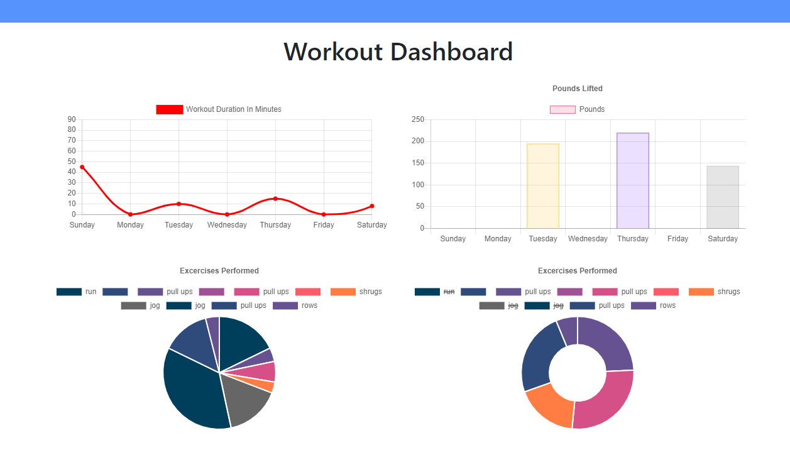

# workout-tracker

</br>
<p align="center">
    
    
    
       
    
    
    
    
    
      
      
      
</p>

## Description

Track your workouts with Workout Tracker. The app will keep track of the exercises in your workout. The dashboard displays graphs that summarize your weekly workouts.

## Table of Contents

* [Installation](#installation)
* [Usage](#usage)
    * [Screenshots](#screenshots)
    * [Snippets](#snippets)
* [Credits](#credits)
* [License](#license)

## Installation

1. Clone repository. 
2. npm install
3. node server.js
4. If you would like to pre-populate the database with seeds, run "npm run seed" in the command line.

<p align="center">
    <a href="https://mighty-spire-59345.herokuapp.com/?id=6023557c98f2b80015c2a689" target="_blank"></a>
</p>

## Usage

### Screeshots

1. Homepage displaying last workout


2. Creating Workouts


3. Last Week's Summary



### Snippets


1. Adding to an array type

```javascript

    // Create workout model
const workoutSchema = new Schema({
  day: {
    type: Date,
    default: Date.now,
  },
  exercises: [
    {
      type: {
        type: String,
        required: true,
      },

      name: {
        type: String,
        required: true,
        trim: true,
      },

      duration: {
        type: Number,
        required: true,
      },

      distance: {
        type: Number,
        required: true,
      },

      weight: {
        type: Number,
        required: true,
      },

      reps: {
        type: Number,
        required: true,
      },

      sets: {
        type: Number,
        required: true,
      },
    },
  ],
  
},
{
  toJSON: {
    virtuals: true,
  },
}
);
    
```
* This is the Mongoose model used to create workouts.

## Credits

### Author

- 💼 Phillip Merriman: [portfolio](https://phillipmerriman.github.io/portfolio/)
- :octocat: Github: [phillipmerriman](https://github.com/phillipmerriman)
-  LinkedIn: [phillip-merriman-jr](https://www.linkedin.com/in/phillip-merriman-jr-62227485/)

### Built With

</br>
<p align="center">
    <a href="https://developer.mozilla.org/en-US/docs/Web/HTML"></a>
    <a href="https://developer.mozilla.org/en-US/docs/Web/CSS"></a>
    <a href="https://www.javascript.com/"></a>
    <a href="https://getbootstrap.com/"></a>
    <a href="https://nodejs.org/en/"></a>
    <a href="https://www.npmjs.com/package/express"></a>
    <a href="https://www.mongodb.com/"></a>
    <a href="https://www.npmjs.com/package/mongoose"></a>
</p>

## License


</br>
<p align="center">
    
</p>
